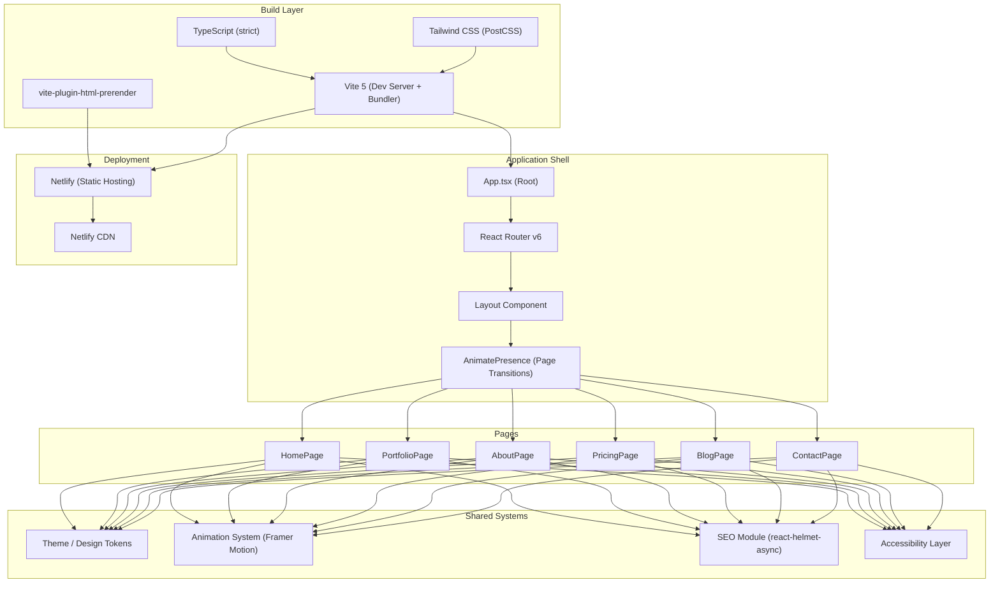
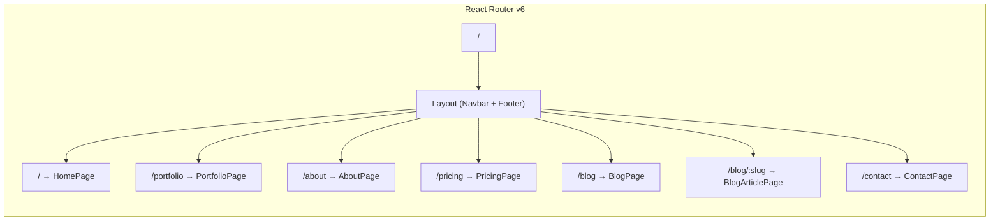

# Technical Design Document

## Overview

This document defines the technical design for the BuildOnCloud Technologies website — a premium, dark-themed single-page application built with React 18+, TypeScript (strict mode), Tailwind CSS, Framer Motion, and Lucide Icons. The website communicates the brand message "Empowering Businesses Through Cloud, AI & Digital Transformation" through a futuristic, elegant interface inspired by leading SaaS companies.

The application is structured as a client-side routed SPA with 6 pages (Home, Portfolio, About, Pricing, Blog, Contact), pre-rendered at build time for SEO, and deployed as static assets to Netlify. The design prioritizes performance (Lighthouse 90+, LCP < 2.5s, initial bundle < 200KB), WCAG 2.1 AA accessibility, and a polished animation system using Framer Motion.

### Key Design Decisions

| Decision | Choice | Rationale |
|----------|--------|-----------|
| Build Tool | Vite 5+ | Fastest HMR, native ESM, tree-shaking, excellent React/TS support |
| Router | React Router v6 | Industry standard, supports layout routes, integrates with AnimatePresence |
| SEO Strategy | react-helmet-async + vite-plugin-html-prerender | Dynamic head management + build-time pre-rendering for crawler-friendly static HTML |
| State Management | React Context + useState/useReducer | Sufficient for UI state (no server state); avoids unnecessary bundle size |
| Form Handling | Custom hooks with validation | Lightweight; no external form library needed for the scope |
| Animation | Framer Motion (motion, AnimatePresence, useInView) | Required by spec; rich API for page transitions, scroll reveals, hover effects |
| Icons | Lucide React | Required by spec; tree-shakeable, accessible SVG icons |
| CSS Strategy | Tailwind CSS with custom theme + component classes | Utility-first with design tokens for the color palette, spacing, and typography |

---

## Architecture

### High-Level Architecture



### Project Structure

```
src/
├── main.tsx                    # Entry point, mounts React app
├── App.tsx                     # Root component with Router + HelmetProvider
├── assets/                     # Static images, fonts, favicons
├── components/
│   ├── layout/
│   │   ├── Navbar.tsx
│   │   ├── Footer.tsx
│   │   ├── Layout.tsx          # Shared layout wrapper (Navbar + Footer + Outlet)
│   │   └── LoadingScreen.tsx
│   ├── ui/
│   │   ├── ServiceCard.tsx
│   │   ├── PortfolioCard.tsx
│   │   ├── PricingCard.tsx
│   │   ├── BlogCard.tsx
│   │   ├── TestimonialCard.tsx
│   │   ├── FAQAccordion.tsx
│   │   ├── NewsletterForm.tsx
│   │   ├── ContactForm.tsx
│   │   ├── AnimatedCounter.tsx
│   │   ├── WhatsAppButton.tsx
│   │   └── BackToTopButton.tsx
│   └── common/
│       ├── Button.tsx
│       ├── SectionHeading.tsx
│       ├── GlassCard.tsx       # Reusable glassmorphism container
│       └── ScrollReveal.tsx    # Reusable scroll-triggered animation wrapper
├── pages/
│   ├── HomePage.tsx
│   ├── PortfolioPage.tsx
│   ├── AboutPage.tsx
│   ├── PricingPage.tsx
│   ├── BlogPage.tsx
│   ├── BlogArticlePage.tsx
│   └── ContactPage.tsx
├── hooks/
│   ├── useScrollPosition.ts
│   ├── useIntersectionObserver.ts
│   ├── useFormValidation.ts
│   ├── useReducedMotion.ts
│   └── useCounterAnimation.ts
├── data/
│   ├── services.ts
│   ├── portfolio.ts
│   ├── pricing.ts
│   ├── blog.ts
│   ├── testimonials.ts
│   ├── faq.ts
│   └── seo.ts
├── utils/
│   ├── validation.ts
│   ├── animation.ts           # Shared Framer Motion variants
│   └── seo.ts                 # SEO helpers (meta generation, JSON-LD)
├── types/
│   └── index.ts               # Shared TypeScript interfaces
└── styles/
    └── globals.css            # Tailwind directives + custom CSS variables
```

### Routing Architecture



Routes are defined declaratively. The Layout component wraps all pages with persistent Navbar and Footer. AnimatePresence wraps the Outlet for page transition animations.

### Performance Strategy

| Target | Strategy |
|--------|----------|
| LCP < 2.5s | Preload hero fonts, lazy-load below-fold images, minimal critical CSS |
| Initial bundle < 200KB | Code-splitting per page with React.lazy(), tree-shake Lucide Icons |
| Lighthouse 90+ | Pre-rendered HTML, optimized images (WebP), proper cache headers |
| CLS < 0.1 | Fixed dimensions for images/cards, font-display: swap |

Code splitting boundaries align with page routes — each page is a lazy-loaded chunk. Shared components (Navbar, Footer, animation utilities) remain in the main bundle.

---

## Components and Interfaces

### Layout Components

#### `Layout`
Shared wrapper providing consistent page structure.

```typescript
interface LayoutProps {
  children?: React.ReactNode;
}
```

Responsibilities:
- Renders Navbar (sticky top), page content via `<Outlet />`, and Footer
- Wraps Outlet in `<AnimatePresence mode="wait">` for page transitions
- Renders WhatsAppButton and BackToTopButton as persistent floating elements
- Provides scroll restoration on route change

#### `Navbar`
Persistent sticky navigation bar.

```typescript
interface NavLink {
  label: string;
  path: string;
  isSection?: boolean; // true for same-page section links on Home
}

interface NavbarProps {
  // No props - uses router context for active state
}
```

State:
- `isScrolled: boolean` — triggers glassmorphism background when scrolled past hero
- `isMobileMenuOpen: boolean` — controls hamburger menu visibility on mobile
- Active link detection via `useLocation()`

Behavior:
- Height: max 80px, `position: sticky`, `z-index: 50`
- Below 768px: hamburger icon toggles slide-out panel
- Scroll > hero height: apply `backdrop-blur-xl bg-navy-900/85` glassmorphism
- Active link gets `text-blue-400 border-b-2 border-blue-400` styling

#### `LoadingScreen`
Full-viewport animated splash screen.

```typescript
interface LoadingScreenProps {
  onComplete: () => void;
}
```

Behavior:
- Displays animated logo (pulse/spin) centered on `bg-navy-950` full-screen overlay
- Minimum display: 800ms, maximum: 3000ms
- Waits for critical assets via `document.fonts.ready` + image preload promises
- On complete: 300ms opacity fade-out, then calls `onComplete` to unmount
- Uses `z-index: 9999` to cover all content

#### `Footer`
Site-wide footer with links, social icons, newsletter form.

```typescript
interface FooterProps {
  // No props - self-contained
}
```

Content: Logo, quick links (all pages), contact info, social links (LinkedIn, Facebook), newsletter subscription form, copyright.

### UI Components

#### `ServiceCard`

```typescript
interface ServiceCardProps {
  icon: LucideIcon;
  title: string;
  description: string;
  index: number; // For stagger delay
}
```

Behavior:
- Glassmorphism card with Lucide icon, title, description
- Hover: `scale(1.03)` + glow box-shadow (electric blue, 6px spread, 0.2 opacity)
- Scroll reveal: fade-up with stagger delay of `index * 150ms`

#### `PortfolioCard`

```typescript
interface PortfolioCardProps {
  project: PortfolioProject;
  onViewDetails: (project: PortfolioProject) => void;
}
```

Behavior:
- Displays project image, title, truncated description (120 chars), tech stack tags
- "View Details" button opens modal or expanded view
- Filter transitions: `AnimatePresence` with fade in/out (300ms)

#### `PricingCard`

```typescript
interface PricingCardProps {
  tier: PricingTier;
  isRecommended: boolean;
  onSelect: (tierName: string) => void;
}
```

Behavior:
- Displays tier name, price with currency, feature list, CTA button
- Recommended card: "Recommended" badge + distinct blue border/glow
- Hover: scale(1.03) + elevated glow
- CTA click: navigates to `/contact?tier={tierName}`
- Consistent height via `min-h-[500px]` or flex-grow strategy

#### `BlogCard`

```typescript
interface BlogCardProps {
  article: BlogArticle;
}
```

Behavior:
- Featured image (with alt text), title, date, category tag, excerpt (150 chars)
- Click navigates to `/blog/{slug}`
- Image lazy-loaded with placeholder

#### `TestimonialCard`

```typescript
interface TestimonialCardProps {
  testimonial: Testimonial;
  isActive: boolean;
}
```

Part of a carousel controlled by parent `TestimonialsSection`.

#### `FAQAccordion`

```typescript
interface FAQAccordionProps {
  items: FAQItem[];
}

interface FAQAccordionItemProps {
  item: FAQItem;
  isExpanded: boolean;
  onToggle: () => void;
}
```

Behavior:
- Single-open accordion (expanding one collapses others)
- Height transition: `animate={{ height: "auto" }}` via Framer Motion (200-400ms)
- Visual indicator: chevron icon rotates 180° when expanded
- Keyboard: Enter/Space toggles, proper `aria-expanded` and `aria-controls`

#### `AnimatedCounter`

```typescript
interface AnimatedCounterProps {
  target: number;
  label: string;
  suffix?: string; // e.g., "+"
  duration?: number; // default 2000ms
}
```

Behavior:
- Uses `useInView` to trigger once when visible
- Animates from 0 to target using `requestAnimationFrame` over 2000ms
- Easing: ease-out for natural deceleration
- Once animated, stores final value (no re-trigger)

#### `WhatsAppButton`

```typescript
interface WhatsAppButtonProps {
  phoneNumber: string;
  message: string;
}
```

Behavior:
- Fixed `bottom-6 right-6`, `z-index: 40`
- Green (#25D366) circular button with WhatsApp icon
- Pulse animation: CSS `animate-pulse` on 3s cycle
- Click: opens `https://wa.me/{phone}?text={encodedMessage}`
- Min size: 44x44px on all viewports
- Respects 10px spacing from BackToTopButton (stacks vertically)

#### `BackToTopButton`

```typescript
interface BackToTopButtonProps {
  // No props - uses scroll position hook
}
```

Behavior:
- Visible when `scrollY > 400px`, fade-in/out (300ms)
- Fixed `bottom-6 right-6` (above WhatsApp button: `bottom-20 right-6`)
- Click: `window.scrollTo({ top: 0, behavior: 'smooth' })` within 300-800ms
- Keyboard focusable, `aria-label="Back to top"`

#### `ScrollReveal`

```typescript
interface ScrollRevealProps {
  children: React.ReactNode;
  direction?: 'up' | 'down' | 'left' | 'right';
  delay?: number;
  duration?: number;
  threshold?: number; // viewport intersection ratio
}
```

Reusable wrapper that animates children when they enter viewport at specified threshold. Uses Framer Motion `useInView` + `motion.div`. Respects `prefers-reduced-motion`.

#### `GlassCard`

```typescript
interface GlassCardProps {
  children: React.ReactNode;
  className?: string;
  hover?: boolean; // enable hover scale + glow
}
```

Reusable glassmorphism container: `bg-white/5 backdrop-blur-xl border border-white/10 rounded-2xl`.

#### `NewsletterForm`

```typescript
interface NewsletterFormProps {
  // No props - self-contained
}
```

Behavior:
- Email input (min-width: 200px) + "Subscribe" button
- Validates email format (contains `@` and valid domain with `.`)
- Success: shows confirmation message, clears input
- Error: inline error message adjacent to field, preserves input

#### `ContactForm`

```typescript
interface ContactFormProps {
  prefilledTier?: string; // From pricing page navigation
}
```

Fields: name, email, phone (optional), subject, message
Validation rules per Requirement 13.
Behavior:
- Inline error messages per field on blur/submit
- Success: confirmation message + clear all fields
- Network error: error message + preserve all data
- Pre-filled tier from URL param (`?tier=Professional`)

#### `SectionHeading`

```typescript
interface SectionHeadingProps {
  title: string;
  subtitle?: string;
  centered?: boolean;
}
```

Consistent section header with gradient text effect on title.

### Shared Hooks

#### `useScrollPosition`
```typescript
function useScrollPosition(): number;
```
Returns current `window.scrollY`, throttled to 16ms (60fps). Used by Navbar and BackToTopButton.

#### `useReducedMotion`
```typescript
function useReducedMotion(): boolean;
```
Returns `true` if `prefers-reduced-motion: reduce` is active. All animation components check this to disable motion.

#### `useFormValidation`
```typescript
interface ValidationRules {
  [field: string]: {
    required?: boolean;
    minLength?: number;
    maxLength?: number;
    pattern?: RegExp;
    message: string;
  };
}

interface UseFormValidationReturn<T> {
  values: T;
  errors: Partial<Record<keyof T, string>>;
  touched: Partial<Record<keyof T, boolean>>;
  handleChange: (field: keyof T, value: string) => void;
  handleBlur: (field: keyof T) => void;
  validate: () => boolean;
  reset: () => void;
}

function useFormValidation<T>(initialValues: T, rules: ValidationRules): UseFormValidationReturn<T>;
```

#### `useCounterAnimation`
```typescript
function useCounterAnimation(target: number, duration: number, shouldAnimate: boolean): number;
```
Returns the current animated value from 0 to target over duration using requestAnimationFrame with ease-out easing.

#### `useIntersectionObserver`
```typescript
interface UseIntersectionOptions {
  threshold?: number;
  triggerOnce?: boolean;
}

function useIntersectionObserver(options?: UseIntersectionOptions): {
  ref: React.RefObject<HTMLElement>;
  isInView: boolean;
};
```

---

## Data Models

### Type Definitions

```typescript
// src/types/index.ts

export interface Service {
  id: string;
  icon: string; // Lucide icon name
  title: string;
  description: string;
  category: string;
}

export interface PortfolioProject {
  id: string;
  title: string;
  shortDescription: string; // max 120 chars
  fullDescription: string;
  image: string;
  category: string;
  techStack: string[];
  objectives: string[];
  liveUrl?: string;
  demoUrl?: string;
}

export interface PricingTier {
  id: string;
  name: 'Starter' | 'Professional' | 'Enterprise';
  price: number;
  currency: string;
  period: string;
  features: string[]; // 3-8 items
  ctaLabel: string;
  isRecommended: boolean;
}

export interface BlogArticle {
  id: string;
  slug: string;
  title: string; // max 100 chars
  excerpt: string; // max 150 chars
  content: string; // full article markdown/HTML
  category: string;
  keywords: string[];
  featuredImage: string;
  featuredImageAlt: string;
  publishedDate: string; // ISO 8601
  author: string;
}

export interface Testimonial {
  id: string;
  clientName: string; // max 60 chars
  company: string; // max 80 chars
  text: string; // max 300 chars
  avatar: string;
  rating?: number;
}

export interface FAQItem {
  id: string;
  question: string;
  answer: string;
}

export interface ContactFormData {
  name: string; // max 100 chars
  email: string; // max 254 chars
  phone: string; // optional, max 20 chars
  subject: string; // max 150 chars
  message: string; // min 10, max 2000 chars
  tier?: string; // pre-filled from pricing
}

export interface ValueProposition {
  id: string;
  icon: string;
  label: string;
  description: string; // max 150 chars
}

export interface StatCounter {
  id: string;
  target: number;
  label: string;
  suffix?: string;
}

export interface NavLink {
  label: string;
  path: string;
  isSection?: boolean;
}

export interface SEOMetadata {
  title: string; // 30-60 chars
  description: string; // 50-160 chars
  ogImage?: string;
  ogUrl: string;
  keywords?: string[];
  structuredData?: Record<string, unknown>;
}
```

### Static Data Files

Data is stored in TypeScript files in `src/data/` as typed constants. This keeps data co-located, type-safe, and eliminates runtime fetching for content that doesn't change between deployments.

```typescript
// src/data/services.ts
export const services: Service[] = [
  {
    id: 'web-development',
    icon: 'Globe',
    title: 'Website Development',
    description: 'Professional, responsive websites for digital presence',
    category: 'development'
  },
  // ... 4 more
];
```

```typescript
// src/data/seo.ts
export const pageSEO: Record<string, SEOMetadata> = {
  home: {
    title: 'BuildOnCloud | Cloud, AI & Digital Transformation',
    description: 'Empowering businesses through cloud engineering, AI solutions, and digital transformation. Build. Innovate. Scale.',
    ogUrl: 'https://buildoncloud.co.uk/',
    structuredData: { /* Organization JSON-LD */ }
  },
  // ... per-page metadata
};
```

### SEO & Structured Data Model

```typescript
// Organization JSON-LD
interface OrganizationSchema {
  '@context': 'https://schema.org';
  '@type': 'Organization';
  name: string;
  url: string;
  logo: string;
  description: string;
  contactPoint: {
    '@type': 'ContactPoint';
    telephone: string;
    contactType: string;
  };
  sameAs: string[]; // social links
}

// Service JSON-LD
interface ServiceSchema {
  '@context': 'https://schema.org';
  '@type': 'Service';
  name: string;
  description: string;
  provider: { '@type': 'Organization'; name: string };
}
```

---

## Correctness Properties

*A property is a characteristic or behavior that should hold true across all valid executions of a system — essentially, a formal statement about what the system should do. Properties serve as the bridge between human-readable specifications and machine-verifiable correctness guarantees.*

### Property 1: Contact form validation rejects invalid input and preserves data

*For any* contact form state with at least one invalid field (empty name, malformed email, empty subject, or message below 10 characters), calling the validation function SHALL return errors for each invalid field, and no entered form data SHALL be cleared or modified.

**Validates: Requirements 13.2, 13.4**

### Property 2: Contact form validation accepts all valid input

*For any* contact form data where name is non-empty (≤100 chars), email contains "@" followed by a valid domain (≤254 chars), subject is non-empty (≤150 chars), and message is between 10 and 2000 characters, the validation function SHALL return zero errors.

**Validates: Requirements 13.1, 13.2**

### Property 3: Email format validation correctness

*For any* string, the email validation function SHALL accept it if and only if it contains an "@" character followed by a domain portion containing at least one "." character — and SHALL reject all other strings. This property applies to both the contact form email field and the newsletter subscription form.

**Validates: Requirements 13.2, 16.2**

### Property 4: Blog search and filter intersection

*For any* non-empty search term and any selected category applied to the blog article list, every article in the filtered result set SHALL match the search term (appearing in title or keywords) AND belong to the selected category. Conversely, no article satisfying both criteria SHALL be excluded from the result set.

**Validates: Requirements 12.2, 12.4, 12.7**

### Property 5: Portfolio category filter completeness

*For any* selected filter category applied to the portfolio project list, the result set SHALL contain exactly those projects whose category matches the selected filter — no more, no less.

**Validates: Requirements 9.2, 9.3**

### Property 6: FAQ accordion single-open invariant

*For any* sequence of toggle actions on the FAQ accordion (regardless of order, repetition, or item count), at most one item SHALL be in the expanded state after each action completes.

**Validates: Requirements 15.2, 15.3, 15.4**

### Property 7: SEO metadata uniqueness and bounds

*For any* page in the application's route table, the generated meta title SHALL be between 30 and 60 characters inclusive, the meta description SHALL be between 50 and 160 characters inclusive, and the set of all page meta titles SHALL contain no duplicates.

**Validates: Requirements 20.1**

### Property 8: Testimonial carousel modular navigation

*For any* starting index in the testimonial list and any number of forward or backward navigation steps, the resulting active index SHALL equal `(start + steps) mod totalItems`, ensuring correct wrapping from last-to-first and first-to-last.

**Validates: Requirements 14.2**

---

## Error Handling

### Error Categories and Strategies

| Category | Scenario | Handling |
|----------|----------|----------|
| Asset Load Failure | Hero background animation fails | Fallback to static gradient background (Req 6.9) |
| Form Submission Error | Network failure on contact form submit | Show inline error message, preserve all form data (Req 13.8) |
| Navigation Failure | Route navigation interrupted | Show error toast, remain on current page (Req 11.6) |
| Content Load Failure | About page section fails to render | Render remaining sections without interruption (Req 10.5) |
| Loading Timeout | Critical assets exceed 3s load | Dismiss loading screen, render with available assets (Req 5.4) |
| Empty Results | Portfolio filter or blog search returns no results | Display "no results" message with suggestion (Req 9.6, 12.3) |

### Error Boundary Strategy

```typescript
// Top-level ErrorBoundary wraps the app
// Per-section error boundaries for isolated failure recovery

interface ErrorBoundaryProps {
  fallback: React.ReactNode;
  children: React.ReactNode;
}
```

Each page section is wrapped in an error boundary so that a failure in one section (e.g., testimonials) does not crash the entire page. The fallback renders either nothing (for non-critical sections) or a minimal placeholder.

### Form Error Handling Pattern

1. **Client-side validation** runs on blur and submit
2. **Inline errors** appear adjacent to each field immediately
3. **On network error**: display banner error + preserve all entered data
4. **On success**: show success message + clear form + reset state
5. **Focus management**: on error, focus moves to first invalid field

### Animation Fallbacks

- If `prefers-reduced-motion` is active: all animations resolve instantly (opacity-only transitions)
- If Framer Motion fails to initialize: components render without animation (static display)
- If hero canvas/particle animation fails: CSS gradient background fills the hero section

---

## Testing Strategy

### Testing Architecture

```
tests/
├── unit/
│   ├── validation.test.ts       # Form validation logic
│   ├── seo.test.ts              # SEO metadata generation
│   ├── filter.test.ts           # Blog/portfolio filtering
│   └── animation.test.ts        # Animation variant generation
├── property/
│   ├── validation.property.ts   # PBT: form validation properties
│   ├── filter.property.ts       # PBT: search/filter properties
│   ├── faq.property.ts          # PBT: accordion state machine
│   ├── seo.property.ts          # PBT: metadata bounds/uniqueness
│   └── carousel.property.ts    # PBT: testimonial wrapping
├── component/
│   ├── Navbar.test.tsx
│   ├── ContactForm.test.tsx
│   ├── FAQAccordion.test.tsx
│   ├── PricingCard.test.tsx
│   └── BlogCard.test.tsx
├── integration/
│   ├── navigation.test.tsx      # Route transitions
│   ├── pricing-flow.test.tsx    # Pricing → Contact flow
│   └── blog-search.test.tsx     # Search + filter combined
└── a11y/
    └── accessibility.test.tsx   # axe-core automated checks per page
```

### Testing Tools

| Tool | Purpose |
|------|---------|
| Vitest | Test runner (Vite-native, fast) |
| React Testing Library | Component testing |
| fast-check | Property-based testing library |
| axe-core / vitest-axe | Accessibility automated audits |
| MSW (Mock Service Worker) | Mock API responses for form submission |

### Property-Based Testing Configuration

- Library: **fast-check**
- Minimum iterations: **100 per property**
- Each property test tagged with: `Feature: buildoncloud-website, Property {N}: {title}`

**Property tests cover:**
- Contact form validation rejection + preservation (Property 1)
- Contact form validation acceptance (Property 2)
- Email format validation correctness (Property 3)
- Blog search/filter intersection logic (Property 4)
- Portfolio category filter completeness (Property 5)
- FAQ accordion single-open state invariant (Property 6)
- SEO metadata bounds and uniqueness (Property 7)
- Testimonial carousel modular navigation (Property 8)

### Unit Tests Cover:
- Specific edge cases: empty strings, max-length strings, special characters in emails
- Component rendering: correct content displayed for each service/portfolio/pricing card
- Animation variant generation for different directions and delays
- Responsive breakpoint logic

### Integration Tests Cover:
- Full pricing → contact flow with tier pre-fill
- Blog search + category filter combination
- Navigation transitions between all routes
- Loading screen lifecycle (min/max timing)

### Accessibility Tests:
- axe-core scan of each rendered page
- Keyboard navigation flow (Tab order, Enter/Space activation)
- Focus management on dynamic content (modals, form errors)
- Reduced motion behavior verification

### Performance Testing:
- Lighthouse CI in CI/CD pipeline targeting 90+ score
- Bundle size check (< 200KB initial)
- LCP measurement on home page (< 2.5s)
